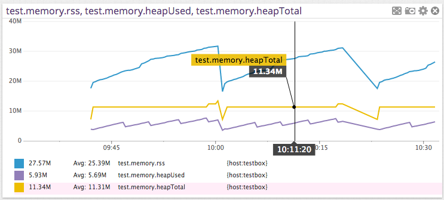

# datadog-metrics
> Buffered metrics reporting via the Datadog HTTP API.

[![NPM Version][npm-image]][npm-url]
[![Build Status][ci-status-image]][ci-status-url]
[![Downloads Stats][npm-downloads]][npm-url]

Datadog-metrics lets you collect application metrics through Datadog's HTTP API. Using the HTTP API has the benefit that you **don't need to install the Datadog Agent (StatsD)**. Just get an API key, install the module and you're ready to go.

The downside of using the HTTP API is that it can negatively affect your app's performance. Datadog-metrics **solves this issue by buffering metrics locally and periodically flushing them** to Datadog.

## Installation

Datadog-metrics is compatible with Node.js v12 and later. You can install it with NPM:

```sh
npm install datadog-metrics --save
```

## Example



Save the following into a file named `example_app.js`:
```js
var metrics = require('datadog-metrics');
metrics.init({ host: 'myhost', prefix: 'myapp.' });

function collectMemoryStats() {
    var memUsage = process.memoryUsage();
    metrics.gauge('memory.rss', memUsage.rss);
    metrics.gauge('memory.heapTotal', memUsage.heapTotal);
    metrics.gauge('memory.heapUsed', memUsage.heapUsed);
};

setInterval(collectMemoryStats, 5000);
```

Run it:
```sh
DATADOG_API_KEY=YOUR_KEY DEBUG=metrics node example_app.js
```

## Tutorial

There's also a longer [tutorial](https://dbader.org/blog/monitoring-your-nodejs-app-with-datadog) that walks you through setting up a monitoring dashboard on Datadog using datadog-metrics.


## Usage

### Datadog API key

Make sure the `DATADOG_API_KEY` environment variable is set to your Datadog
API key (you can also set it via the `apiKey` option in code). You can find the API key under [Integrations > APIs](https://app.datadoghq.com/account/settings#api). *Please note the API key is different from an **application key**. For more details, see [Datadog’s “API and Application Keys” docs](https://docs.datadoghq.com/account_management/api-app-keys/).*

### Module setup

There are three ways to use this module to instrument an application.
They differ in the level of control that they provide.

#### Use case #1: Just let me track some metrics already!

Just require datadog-metrics and you're ready to go. After that you can call
`gauge`, `increment` and `histogram` to start reporting metrics.

```js
var metrics = require('datadog-metrics');
metrics.gauge('mygauge', 42);
```

#### Use case #2: I want some control over this thing!

If you want more control you can configure the module with a call to `init`.
Make sure you call this before you use the `gauge`, `increment` and `histogram`
functions. See the documentation for `init` below to learn more.

```js
var metrics = require('datadog-metrics');
metrics.init({ host: 'myhost', prefix: 'myapp.' });
metrics.gauge('mygauge', 42);
```


#### Use case #3: Must. Control. Everything.

If you need even more control you can create one or more `BufferedMetricsLogger` instances and manage them yourself:

```js
var metrics = require('datadog-metrics');
var metricsLogger = new metrics.BufferedMetricsLogger({
    site: 'datadoghq.eu',
    apiKey: 'TESTKEY',
    host: 'myhost',
    prefix: 'myapp.',
    flushIntervalSeconds: 15,
    defaultTags: ['env:staging', 'region:us-east-1'],
    onError (error) {
        console.error('There was an error auto-flushing metrics:', error);
    }
});
metricsLogger.gauge('mygauge', 42);
```

## API

### Initialization

`metrics.init(options)`

Where `options` is an object and can contain the following:

* `host`: Sets the hostname reported with each metric. (optional)
    * Setting a hostname is useful when you're running the same application
      on multiple machines and you want to track them separately in Datadog.
* `prefix`: Sets a default prefix for all metrics. (optional)
    * Use this to namespace your metrics.
* `flushIntervalSeconds`: How often to send metrics to Datadog. (optional)
    * This defaults to 15 seconds. Set it to 0 to disable auto-flushing which
      means you must call `flush()` manually.
* `site`: Sets the Datadog "site", or server where metrics are sent. (optional)
    * Defaults to `datadoghq.com`.
    * See more details on setting your site at:
        https://docs.datadoghq.com/getting_started/site/#access-the-datadog-site
* `apiKey`: Sets the Datadog API key. (optional)
    * It's usually best to keep this in an environment variable.
      Datadog-metrics looks for the API key in `DATADOG_API_KEY` by default.
    * You must either set this option or the environment variable. An API key
      is required to send metrics.
    * Make sure not to confuse this with your _application_ key! For more
      details, see: https://docs.datadoghq.com/account_management/api-app-keys/
* `appKey`: Sets the Datadog application key. (optional)
    * It's usually best to keep this in an environment variable. Datadog-metrics
      looks for the application key in `DATADOG_APP_KEY` by default.
    * This is different from the API key (see above), which is required. For
      more about the different between API and application keys, see:
      https://docs.datadoghq.com/account_management/api-app-keys/
* `defaultTags`: Default tags used for all metric reporting. (optional)
    * Set tags that are common to all metrics.
* `onError`: A function to call when there are asynchronous errors seding
    buffered metrics to Datadog. It takes one argument (the error). (optional)
    * If the error was not handled (either by setting this option or by
      specifying a handler when manually calling `flush()`), the error will be
      logged to stdout.
* `histogram`: An object with default options for all histograms. This has the
    same properties as the options object on the `histogram()` method. Options
    specified when calling the method are layered on top of this object.
    (optional)
* `reporter`: An object that actually sends the buffered metrics. (optional)
    * There are two built-in reporters you can use:
        1. `reporters.DatadogReporter` sends metrics to Datadog’s API, and is
           the default.
        2. `reporters.NullReporter` throws the metrics away. It’s useful for
           tests or temporarily disabling your metrics.

Example:

```js
metrics.init({ host: 'myhost', prefix: 'myapp.' });
```

Disabling metrics using `NullReporter`:

```js
metrics.init({ host: 'myhost', reporter: metrics.NullReporter() });
```

Send metrics to a totally different service instead of Datadog:

```js
metrics.init({
  reporter: {
    report(series, onSuccess, onError) {
      // `series` is an array of metrics objects, formatted basically how the
      // Datadog v1 metrics API and v1 distributions API want them.
      fetch('https://my-datadog-like-api.com/series', {
          method: 'POST',
          body: JSON.stringify({ series })
        })
          .then(response => response.json())
          .then(() => onSuccess())
          .catch(onError);
    }
  }
});
```


### Gauges

`metrics.gauge(key, value[, tags[, timestamp]])`

Record the current *value* of a metric. The most recent value in
a given flush interval will be recorded. Optionally, specify a set of
tags to associate with the metric. This should be used for sum values
such as total hard disk space, process uptime, total number of active
users, or number of rows in a database table. The optional timestamp
is in milliseconds since 1 Jan 1970 00:00:00 UTC, e.g. from `Date.now()`.

Example:

```js
metrics.gauge('test.mem_free', 23);
```

### Counters

`metrics.increment(key[, value[, tags[, timestamp]]])`

Increment the counter by the given *value* (or `1` by default). Optionally,
specify a list of *tags* to associate with the metric. This is useful for
counting things such as incrementing a counter each time a page is requested.
The optional timestamp is in milliseconds since 1 Jan 1970 00:00:00 UTC,
e.g. from `Date.now()`.

Example:

```js
metrics.increment('test.requests_served');
metrics.increment('test.awesomeness_factor', 10);
```

### Histograms

`metrics.histogram(key, value[, tags[, timestamp[, options]]])`

Sample a histogram value. Histograms will produce metrics that
describe the distribution of the recorded values, namely the minimum,
maximum, average, median, count and the 75th, 85th, 95th and 99th percentiles.
Optionally, specify a list of *tags* to associate with the metric.
The optional timestamp is in milliseconds since 1 Jan 1970 00:00:00 UTC,
e.g. from `Date.now()`.

Example:

```js
metrics.histogram('test.service_time', 0.248);
```

You can also specify an options object to adjust which aggregations and
percentiles should be calculated. For example, to only calculate an average,
count, and 99th percentile:

```js
metrics.histogram('test.service_time', 0.248, ['tag:value'], Date.now(), {
    // Aggregates can include 'max', 'min', 'sum', 'avg', 'median', or 'count'.
    aggregates: ['avg', 'count'],
    // Percentiles can include any decimal between 0 and 1.
    percentiles: [0.99]
});
```

### Distributions

`metrics.distribution(key, value[, tags[, timestamp]])`

Send a distribution value. Distributions are similar to histograms (they create
several metrics for count, average, percentiles, etc.), but they are calculated
server-side on Datadog’s systems. This is much higher-overhead than histograms,
and the individual calculations made from it have to be configured on the
Datadog website instead of in the options for this package.

You should use this in environments where you have many instances of your
application running in parallel, or instances constantly starting and stopping
with different hostnames or identifiers and tagging each one separately is not
feasible. AWS Lambda or serverless functions are a great example of this. In
such environments, you also might want to use a distribution instead of
`increment` or `gauge` (if you have two instances of your app sending those
metrics at the same second, and they are not tagged differently or have
different `host` names, one will overwrite the other — distributions will not).

Example:

```js
metrics.distribution('test.service_time', 0.248);
```

### Flushing

`metrics.flush([onSuccess[, onError]])`

Calling `flush` sends any buffered metrics to Datadog. Unless you set
`flushIntervalSeconds` to 0 it won't be necessary to call this function.

It can be useful to trigger a manual flush by calling if you want to
make sure pending metrics have been sent before you quit the application
process, for example.

## Logging

Datadog-metrics uses the [debug](https://github.com/visionmedia/debug)
library for logging at runtime. You can enable debug logging by setting
the `DEBUG` environment variable when you run your app.

Example:

```sh
DEBUG=metrics node app.js
```

## Tests

```sh
npm test
```

## Release History

* 0.11.2 (2024-06-25)

    * Fix types and documentation for the `aggregates` option for histograms and the `histogram.aggregates` option for the library as a whole. It was previously listed as `aggregations`, which was incorrect. (Thanks to @Calyhre in #117.)

    * Improve documentation and add a more detailed error message about API keys vs. application keys. (#118)

    [View diff](https://github.com/dbader/node-datadog-metrics/compare/v0.11.1...v0.11.2)

* 0.11.1 (2023-09-28)

    **Fixes & Maintenance:**

    * Resolve a deprecation warning from the underlying datadog-api-client library. This also updates the minimum required version of that library. (Thanks to @acatalucci-synth & @fcsonline in #112.)

    [View diff](https://github.com/dbader/node-datadog-metrics/compare/v0.11.0...v0.11.1)

* 0.11.0 (2022-02-21)

    **New Features:**

    * Built-in TypeScript definitions. If you use TypeScript, you no longer need to install separate type definitions from `@types/datadog-metrics` — they’re now built-in. Please make sure to remove `@types/datadog-metrics` from your dev dependencies.

        Even if you’re writing regular JavaScript, you should now see better autocomplete suggestions and documentation in editors that support TypeScript definitions (e.g. VisualStudio Code, WebStorm).

    **Breaking Changes:**

    * datadog-metrics now uses modern `class` syntax internally. In most cases, you shouldn’t need to change anything. However, if you are calling `BufferedMetricsLogger.apply(...)` or `BufferedMetricsLogger.call(...)`, you’ll need to change your code to use `new BufferedMetricsLogger(...)` instead.

    **Deprecated Features:**

    * The `apiHost` option has been renamed to `site` so that it matches up with Datadog docs and official packages. The old `apiHost` name still works for now, but will be removed in the future.

    * The `reporters.DataDogReporter` class has been renamed to `reporters.DatadogReporter` (lower-case D in "dog") so that it correctly matches Datadog’s actual name. The old name still works, but will be removed in the future.

    [View diff](https://github.com/dbader/node-datadog-metrics/compare/v0.10.2...v0.11.0)

* 0.10.2 (2022-10-14)

    This release includes several new features and bugfixes!

    **New Features:**
    * Support for distribution metrics. You can now send distributions to Datadog by doing:

        ```js
        const metrics = require('datadog-metrics');
        metrics.distribution('my.metric.name', 3.8, ['tags:here']);
        ```

        Distributions are similar to histograms (they create several metrics for count, average, percentiles, etc.), but they are calculated server-side on Datadog’s systems. For more details and guidance on when to use them, see:
        * The documentation in this project’s README
        * Datadog’s documentation at https://docs.datadoghq.com/metrics/distributions/

        (Thanks to @Mr0grog.)

    * Add an `onError` option for handling asynchronous errors while flushing buffered metrics. You can use this to get details on an error or to send error info to a tracking service like Sentry.io:

        ```js
        const metrics = require('datadog-metrics');
        metrics.init({
            onError (error) {
                console.error('There was an error sending to Datadog:', error);
            }
        });
        ```

    * The built-in reporter classes are now available for you to use. If you need to disable the metrics library for some reason, you can now do so with:

        ```js
        const metrics = require('datadog-metrics');
        metrics.init({
            reporter: new metrics.reporters.NullReporter(),
        });
        ```

        (Thanks to @Mr0grog.)

    * Add an option for setting histogram defaults. In v0.10.0, the `histogram()` function gained the ability to set what aggregations and percentiles it generates with a final `options` argument. You can now specify a `histogram` option for `init()` or `BufferedMetricsLogger` in order to set default options for all calls to `histogram()`. Any options you set in the actual `histogram()` call will layer on top of the defaults:

        ```js
        const metrics = require('datadog-metrics');
        metrics.init({
            histogram: {
                aggregates: ['sum', 'avg'],
                percentiles: [0.99]
            }
        });

        // Acts as if the options had been set to:
        // { aggregates: ['sum', 'avg'], percentiles: [0.99] }
        metrics.histogram('my.metric.name', 3.8);

        // Acts as if the options had been set to:
        // { aggregates: ['sum', 'avg'], percentiles: [0.5, 0.95] }
        metrics.histogram('my.metric.name', 3.8, [], Date.now(), {
            percentiles: [0.5, 0.95]
        });
        ```

        (Thanks to @Mr0grog.)

    * Add a `.median` aggregation for histograms. When you log a histogram metric, it ultimately creates several metrics that track the minimum value, average value, maximum value, etc. There is now one that tracks the median value. StatsD creates the same metric from histograms, so you may find this useful if transitioning from StatsD. (Thanks to @Mr0grog.)

    * This package no longer locks specific versions of its dependencies (instead, your package manager can choose any version that is compatible). This may help when deduplicating packages for faster installs or smaller bundles. (Thanks to @Mr0grog.)

    **Bug Fixes:**

    * Don’t use `unref()` on timers in non-Node.js environments. This is a step towards browser compatibility, although we are not testing browser-based usage yet. (Thanks to @Mr0grog.)
    * The `apiHost` option was broken in v0.10.0 and now works again. (Thanks to @Mr0grog and @npeters.)
    * Creating a second instance of `BufferedMetricsLogger` will not longer change the credentials used by previously created `BufferedMetricsLogger` instances. (Thanks to @Mr0grog.)

    **Internal Updates:**

    * Renamed the default branch in this repo to `main`. (Thanks to @dbader.)
    * Use GitHub actions for continuous integration. (Thanks to @Mr0grog.)
    * Code style cleanup. (Thanks to @Mr0grog.)
    * When flushing, send each metric with its own list of tags. This helps mitigate subtle errors where a change to one metric’s tags may affect others. (Thanks to @Mr0grog.)

    [View diff](https://github.com/dbader/node-datadog-metrics/compare/v0.10.1...v0.10.2)

* 0.10.1 (2022-09-11)
    * FIX: bug in 0.10.0 where `@datadog/datadog-api-client` was not used correctly. (Thanks to @gquinteros93)
    * [View diff](https://github.com/dbader/node-datadog-metrics/compare/4c29447bbde00565d5258e722b147601f3cc014c...023acfa3a2c5d8dd3f5bbb48c8c02467b2519559)

* 0.10.0 (2022-09-08)
    * **Breaking change:** we now use Datadog’s official `@datadog/datadog-api-client` package to send metrics to Datadog. This makes `datadog-metrics` usable with Webpack, but removes the `agent` option. If you were using this option and the new library does not provide a way to meet your needs, please let us know by filing an issue! (Thanks to @thatguychrisw)
    * You can now customize what metrics are generated by a histogram. When logging a histogram metric, the 5th argument is an optional object with information about which aggregations and percentiles to create metrics for:

        ```js
        const metrics = require('datadog-metrics');
        metrics.histogram('my.metric.name', 3.8, [], Date.now(), {
            // Aggregates can include 'max', 'min', 'sum', 'avg', or 'count'.
            aggregates: ['max', 'min', 'sum', 'avg', 'count'],
            // Percentiles can include any decimal between 0 and 1.
            percentiles: [0.75, 0.85, 0.95, 0.99]
        });
        ```

        (Thanks to @gquinteros93.)

    * INTERNAL: Clean up continuous integration on TravisCI. (Thanks to @ErikBoesen.)

    * [View diff](https://github.com/dbader/node-datadog-metrics/compare/99bdc97cead1d3fabe12bf594e945c64cba5d643...4c29447bbde00565d5258e722b147601f3cc014c)

* 0.9.3 (2021-03-22)
    * INTERNAL: Update `dogapi` and `jshint` to their latest versions. (Thanks to @ErikBoesen.)
    * [View diff](https://github.com/dbader/node-datadog-metrics/compare/6f27d31c7931d3d68cd888a0237c87e3ed4feea1...99bdc97cead1d3fabe12bf594e945c64cba5d643)

* 0.9.2 (2021-03-14)
    * Expose new `apiHost` option on `init()` and `BufferedMetricsLogger` constructor. This makes it possible to actually configure the Datadog site to submit metrics to. For example, you can now submit metrics to Datadog’s Europe servers with:

        ```js
        const metrics = require('datadog-metrics');
        metrics.init({
            apiHost: 'datadoghq.eu'
        });
        ```

        (Thanks to @ErikBoesen.)

    * [View diff](https://github.com/dbader/node-datadog-metrics/compare/8adaeb9f7bff15f620337a0fb882921925d63116...6f27d31c7931d3d68cd888a0237c87e3ed4feea1)

* 0.9.1 (2021-02-19)
    * FIX: Add default Datadog site. (Thanks to @ErikBoesen.)
    * [View diff](https://github.com/dbader/node-datadog-metrics/compare/e58b13055b803a9c4f4c7b2426e3784b8fd4e0ae...8adaeb9f7bff15f620337a0fb882921925d63116)

* 0.9.0 (2021-02-10)
    * Clean up continuous integration tooling on TravisCI. (Thanks to @rpelliard.)
    * Correct “Datadog” throughout the documentation. It turns out there’s not supposed to be a captial D in the middle. (Thanks to @dbenamy.)
    * INTERNAL: Add internal support for submitting metrics to different Datadog sites (e.g. `datadoghq.eu` for Europe). (Thanks to @fermelone.)
    * [View diff](https://github.com/dbader/node-datadog-metrics/compare/ebb4bf701f700841e8b5c5325165f13397249b51...e58b13055b803a9c4f4c7b2426e3784b8fd4e0ae)

* 0.8.2 (2020-11-16)
    * Added @ErikBoesen as a maintainer!
    * INTERNAL: Update `dogapi` version.
    * INTERNAL: Validate the `onSuccess` callback in `NullReporter`. (Thanks to @dkMorlok.)
    * [View diff](https://github.com/dbader/node-datadog-metrics/compare/294e36e411e805c664a2bf614c083ed862860ce1...ebb4bf701f700841e8b5c5325165f13397249b51)

* 0.8.1
    * FIX: don't increment count when value is 0 (Thanks to @haspriyank)
* 0.8.0
    * allow passing in custom https agent (Thanks to @flovilmart)
* 0.7.0
    * update metric type `counter` to `count` as `counter` is deprecated by Datadog (Thanks to @dustingibbs)
* 0.6.1
    * FIX: bump debug to 3.1.0 to fix [NSP Advisory #534](https://nodesecurity.io/advisories/534) (Thanks to @kirkstrobeck)
* 0.6.0
    * FIX: call onSuccess on flush even if buffer is empty (Thanks to @mousavian)
* 0.5.0
    * ADD: ability to set custom timestamps (Thanks to @ronny)
    * FIX: 0 as valid option for flushIntervalSeconds (thanks to @dkMorlok)
* 0.4.0
    * ADD: Initialize with a default set of tags (thanks to @spence)
* 0.3.0
    * FIX: Don't overwrite metrics with the same key but different tags when aggregating them (Thanks @akrylysov and @RavivIsraeli!)
    * ADD: Add success/error callbacks to `metrics.flush()` (Thanks @akrylysov!)
    * ADD: Allow Datadog APP key to be configured (Thanks @gert-fresh!)
    * Bump dependencies to latest
    * Update docs
* 0.2.1
    * Update docs (module code remains unchanged)
* 0.2.0
    * API redesign
    * Remove `setDefaultXYZ()` and added `init()`
* 0.1.1
    * Allow `increment` to be called with a default value of 1
* 0.1.0
    * The first proper release
    * Rename `counter` to `increment`
* 0.0.0
    * Work in progress

## Meta

This module is heavily inspired by the Python [dogapi module](https://github.com/DataDog/dogapi).

Daniel Bader – [@dbader_org](https://twitter.com/dbader_org) – mail@dbader.org

Distributed under the MIT license. See ``LICENSE`` for more information.

[https://github.com/dbader/node-datadog-metrics](https://github.com/dbader/node-datadog-metrics)

[npm-image]: https://img.shields.io/npm/v/datadog-metrics.svg?style=flat-square
[npm-url]: https://npmjs.org/package/datadog-metrics
[npm-downloads]: https://img.shields.io/npm/dm/datadog-metrics.svg?style=flat-square
[ci-status-image]: https://github.com/dbader/node-datadog-metrics/actions/workflows/ci.yml/badge.svg?branch=main
[ci-status-url]: https://github.com/dbader/node-datadog-metrics/actions/workflows/ci.yml?query=branch%3Amain
